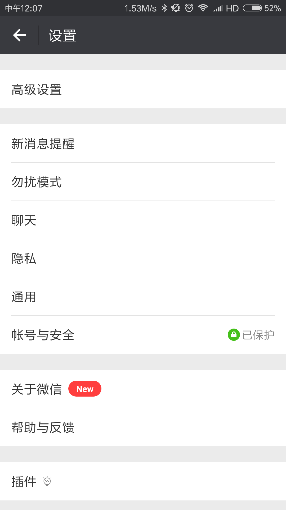
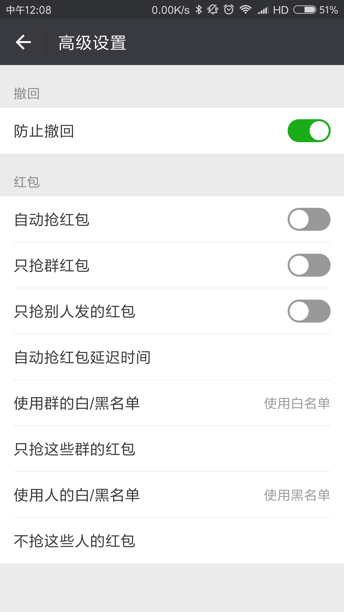
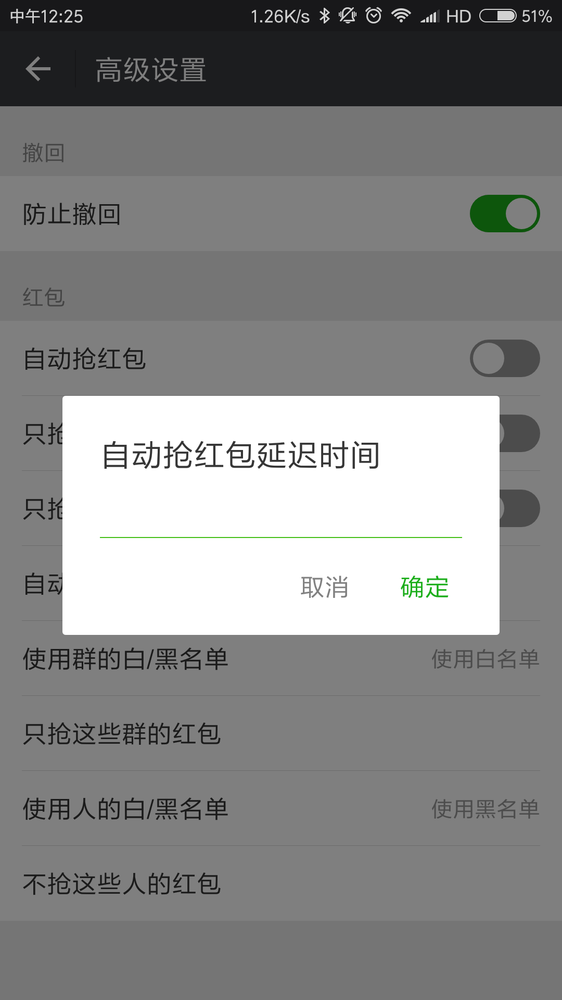
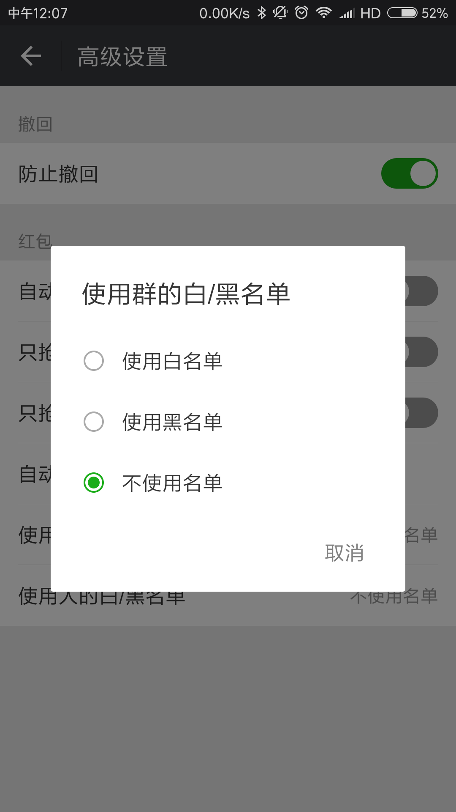
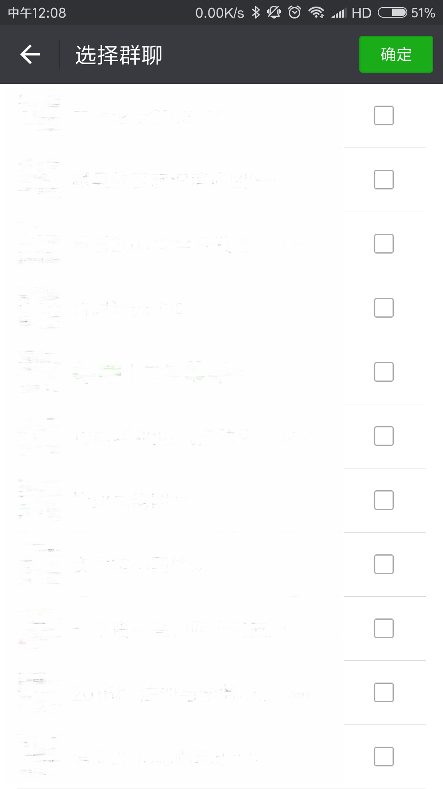
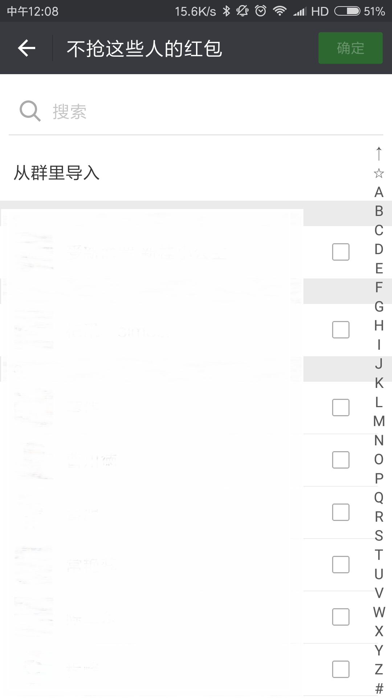

# wechat

modified wechat

## note

近期微信对使用此客户端的用户会发出封号警告，慎重使用。

## Screenshots

    
    
    
    
    
    
    
    

3 复用微信组件和界面
在研究完微信的代码逻辑后，就可以开始添加自己的代码了。反编译微信后得到的都是smali代码，手写那么多smali代码肯定是不太现实的。

 
这里采取的方式是用Android Studio新建一个工程，然后把微信的dex文件变成jar文件，再把这些jar文件当成库导入到工程中。接下来就可以写Java代码了。Java代码写好后，先编译成class文件，然后打包成dex文件，再反编译成smali文件。然后把这些smali文件复制到微信的代码目录中（这个过程好像有点蠢）。最后修改微信代码，在合适的地方调用自己添加的这些代码。

 
思路基本上是这样的，具体步骤太繁杂，这个就不写了。具体代码已经上传到Github，成品就不上传了。
